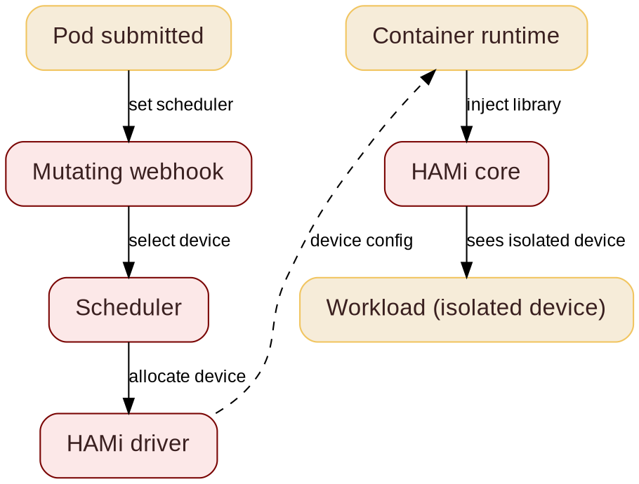

@variant dark
@kicker KubeCon + CloudNativeCon China 2026  -  Embedded & Open AI
# 用 HAMi 简化边缘计算中的 AI

@subtitle 切分一块设备, 运行多个 Agent

@speaker name="Reza Jelveh" role="Dynamia AI 解决方案架构师, HAMi 开发者" github=github.com/fishman linkedin=linkedin.com/in/rezajelveh

---

# 第 1 部分: 问题

@subtitle 难点不是模型本身, 而是算力

---

## 不是所有边缘算力都是 Agent

@subtitle 如今边缘推理大多是 CV 与传统机器学习

<!--
如今运行在边缘设备上的推理大多不是语言模型。YOLO 类检测、分类、OCR、嵌入向量: 都是小模型、毫秒级延迟、在 NPU 和嵌入式 GPU 上已经很便宜。Agent 才是新的一类, 也是调度上最难的: 内存吃紧的 LLM 要在同一台设备上并发运行。
-->

::: grid {cols=3}
::: card {tag=green}
### {icon:scan cls=accent-secondary} CV 与传统推理

- YOLO、分类、OCR、嵌入向量、深度学习
- 1-5000 万参数, 毫秒级延迟
- 如今已运行在 NPU 和嵌入式 GPU 上
:::
::: card {tag=cyan}
### {icon:message-square cls=accent-primary} LLM

- 自回归文本生成
- 权重加 KV 缓存都要驻留内存
- 需要 GPU 级芯片
:::
::: card {tag=red}
### {icon:bot cls=accent-secondary} Agent

- 处于工具调用循环中的 LLM
- 单台设备需要并发多个
- 内存消耗大, 对延迟容忍度高
:::
:::

三类负载共用一种部署模式: 同一块设备同时承载小模型推理与 Agent 任务。

---

## 边缘 Agent 与稀缺的算力

@subtitle 开源 Agent 需要边缘硬件

<!--
Hermes 和 OpenClaw 能推理、会用工具。但把它们部署到边缘很难: 难的不是模型, 而是下面的算力。内存有限、功耗预算紧张、无人值守、没有弹性扩容。要在边缘运行 Agent, 得先解决算力这一层。
-->

Hermes 和 OpenClaw 这类开源 Agent 能推理、会用工具。边缘部署仍然很难: 难的不是模型, 而是下面的算力。

::: grid {cols=2}
::: card {tag=red}
### {icon:memory-stick cls=accent-secondary} 内存有限

一台 Jetson 级设备只有 8-64 GB 统一内存, 还要和系统共享。一套 Agent 就能把它吃光。
:::
::: card {tag=yellow}
### {icon:zap cls=accent-contrast} 功耗预算紧张

边缘没有 300 W 的数据中心 GPU。你只有 5-40 W, 常常还得靠电池或太阳能。
:::
::: card {tag=cyan}
### {icon:user-x cls=accent-primary} 无人值守

没有随叫随到的集群管理员。Prometheus 也许在抓取, 但没人盯着看板。它必须部署好之后就能自己跑。
:::
::: card {tag=green}
### {icon:scale cls=accent-primary} 无法弹性扩容

云端负载涨了: 加 GPU 即可。边缘负载涨了: 无卡可加。部署下去的那台机器就是全部。
:::
:::

要在边缘运行 Agent, 得先解决算力这一层。

---

## 什么是 HAMi

@subtitle 之前: 一块设备, 一个任务

<!--
GPU 昂贵且常常闲置。HAMi 是面向 Kubernetes 的异构 GPU 共享框架。它把 GPU 切开并跨负载共享, 无需改写你的技术栈。
-->


---

## 什么是 HAMi
@transition none

@subtitle 之后: 一块设备, 多个 Agent


---

@layout compare

## 边缘算力的挑战

@subtitle 哪里会崩, HAMi 要解决什么

::: card {tag=compare}
### 现状问题

- 一个模型独占一块设备, 大部分时间闲置
- 固定显存预算: 装一次, 永不共享
- 一个失控的 Agent 就能搞垮整块设备
- 需求天差地别: 从极小的 CV 滤波到大型 Agent LLM
:::

::: arrow

{icon:arrow-right cls=accent-primary size=48}
:::

::: card {tag=compare}
### 需求

- 保证能跑: 无人值守, 没有运维团队
- 运行稳定: 硬性上限, 一个 Agent 弄不死设备
- 负载与设备匹配, 无论大小: CV 用 NPU, LLM 用 GPU 级芯片, 统一 API
- 部署模式不变: 每类设备无需改清单
- 细粒度切分: 划分内存, 需求超量时按时间共享
:::

<!--
边缘的基准完全不同: 没有可观测性体系, 设备必须无人值守运行, 芯片必须匹配负载, 部署模式保持不变。边缘负载从极小的 CV 滤波一路到大型 Agent LLM, 有大有小, 跑在现有的各种芯片上。真正的工作是内存隔离: 切开统一内存让多个 Agent 并发运行, 需求超过内存时再按时间共享。
-->

---

# 第 2 部分: 解决方案

@subtitle 跨异构加速器的一张调度平面

---

## HAMi 核心能力

@subtitle HAMi 为 GPU 调度带来的六项能力

<!--
六项能力。与本次演讲最相关的: 硬隔离、高级调度、统一监控。异构管理才是差异化所在, 不只是 NVIDIA。
-->

::: grid {cols=2}
::: card
### {icon:layers cls=accent-primary} 异构设备统一管理

在一套工作流里管理 GPU、NPU、MLU 及其他加速器。
:::
::: card
### {icon:shield-check cls=accent-primary} 硬隔离

按切片划分内存与算力, 运行期硬性隔离。
:::
::: card
### {icon:git-branch cls=accent-contrast} 高级调度

Binpack、spread 与拓扑感知的放置策略。
:::
::: card
### {icon:box cls=accent-primary} Kubernetes 原生

Kubernetes 原生 API, 支持 DRA 与 CDI。
:::
::: card
### {icon:gauge cls=accent-primary} 资源隔离与 QoS

内存与算力配额, 保证公平、稳定共享。
:::
::: card
### {icon:chart-bar cls=accent-contrast} 统一监控

跨厂商一致的指标与可见性。
:::
:::

---

@layout two-col

## GPU 共享

@subtitle 动态、细粒度的设备切分

<!--
跨厂商同一份 YAML。右侧是昇腾示例。显存是硬上限, 算力是尽力而为。这才是用户真正写的东西。
-->

- 支持 **NVIDIA、昇腾、寒武纪、海光、沐曦**
- **细粒度:** 最小 1MB 显存、1% 算力
- **对任务透明:** 无需改动任何代码
- 容器内**硬性资源隔离**
- 跨厂商统一 API: 同一份 YAML, 任何加速器

@col

```yaml
# 昇腾 910C: 8GB + 20% 算力
resources:
  limits:
    huawei.com/Ascend910C: "1"
    huawei.com/Ascend910C-core: "20"
    huawei.com/Ascend910C-memory: "8192"
```

```yaml
# NVIDIA: 任意 GPU 上 3GB
resources:
  limits:
    nvidia.com/gpu: 1
    nvidia.com/gpumem: 3000
```

---

## 切分的几种方式

@subtitle 共享一块设备的四种方式

<!--
切分有四种口味。内存与算力切分是 HAMi 的核心: 1 MiB 内存、1% 算力。算力切分限制一个 Pod 能使用的设备算力百分比; 它在每次内核启动时都被执行, 即使设备空闲, Pod 也不能超出它的切片 (MPS %, dcucores, vcore 只是同一配额在不同厂商下的叫法)。时间切片纯粹是软件: 没有厂商提供时间量程 API, 由调度器按时间轮转算力访问。所以即使厂商不暴露任何切分机制, 你也能钩住它的驱动 SDK 自己做一个。这就是逆向工程: 脆弱, 一旦 SDK 更新就崩。更好的做法是请厂商提供支持, HAMi 与 NVIDIA 和华为正是这样合作的。

算力切分是目标, 但机制取决于厂商。HAMi 对外暴露统一 API (gpucores: 40) 再自行适配: NVIDIA 与昇腾没有硬件算力上限, 所以 HAMi 在用户态拦截启动 (libvgpu.so, 令牌桶), 最小粒度 1%。AMD CU 掩码与 NVIDIA MPS 是硬件调度器背书的上限, 对进程是静态的。寒武纪 vXPU 和海光 vDCU 是硬件围栏, 较粗但由芯片执行。边界情况: 完全没有机制的厂商, 比如 DeepX 和 Axelera, 没有劫持点也没有配额 API, 不做逆向工程就无法实现算力切分。
-->

::: grid {cols=2}
::: card {tag=green}
### {icon:memory-stick cls=accent-secondary} 内存切分

- 按租户划分内存
- HAMi: 每 Pod 最小 1 MiB
- 原生: 固定分区 (MIG, vXPU)
:::
::: card {tag=cyan}
### {icon:gauge cls=accent-secondary} 算力切分

- 把算力限制为设备的百分比
- HAMi: 每 Pod 最小 1%
:::
::: card {tag=yellow}
### {icon:clock cls=accent-contrast} 时间切片

- 负载轮流使用
- 纯软件实现
:::
::: card {tag=red}
### {icon:layers cls=accent-primary} 硬件分区

- MIG、SR-IOV、vXPU、vDCU
- 静态, 隔离最强
:::
:::

**时间切片是纯软件实现:** 可以逆向工程, 但更好的做法是让厂商 SDK 提供支持。

---

## 内存切分

@subtitle 把闲置内存切成每 Pod 一片

<!--
真实测量过的任务, 每个独占整块 H200 (141 GB): 时间序列推理任务用了 1 GB, YOLO 训练任务用了 39 GB。整卡分配浪费了约 100 GB。内存切分把它切成 MiB 级分区, 每 Pod 一个, 动态调整。
-->

::: card
```seaborn
import matplotlib.pyplot as plt

fg = plt.rcParams["text.color"]
dimmed = plt.rcParams["xtick.color"]
cmap = plt.get_cmap("Paired")
red = cmap(4.5 / 12)
yellow = cmap(6.5 / 12)
grey = "#eceae8"

fig, ax = plt.subplots(figsize=(9.5, 2.9))
ax.set_facecolor("none")
fig.patch.set_alpha(0)

ax.text(-4, 1.75, "GPU MEMORY: ALLOCATED VS USED", fontsize=10.5, color=dimmed, family="monospace")

ax.barh(1, 141, color=grey, height=0.5)
ax.barh(1, 2, color=red, height=0.5)
ax.barh(0, 141, color=grey, height=0.5)
ax.barh(0, 39, left=2, color=yellow, height=0.5)

ax.text(-4, 1, "Inference\njob", ha="right", va="center", fontsize=12, color=fg, fontweight="bold", linespacing=1.4)
ax.text(-4, 0, "Training\njob", ha="right", va="center", fontsize=12, color=fg, fontweight="bold", linespacing=1.4)

ax.text(6, 1, "2 GB used", ha="left", va="center", fontsize=11.5, color=fg)
ax.text(44, 0, "39 GB used", ha="left", va="center", fontsize=11.5, color=fg)

ax.text(141, 1.42, "one whole H200 = 141 GB", ha="right", va="bottom", fontsize=10.5, color=dimmed)

ax.annotate("", xy=(139, -0.55), xytext=(41, -0.55),
            arrowprops=dict(arrowstyle="<->", color=dimmed, linewidth=1.4))
ax.text(90, -0.74, "~100 GB free: sliced per pod",
        ha="center", va="top", fontsize=10.5, color=fg, fontweight="bold")

ax.set_xlim(-4, 148)
ax.set_ylim(-1.15, 1.95)
ax.spines[["top", "right", "left", "bottom"]].set_visible(False)
ax.tick_params(left=False, bottom=False, labelleft=False, labelbottom=False)
ax.set_xticks([])
```
:::

- 一个任务独占整卡: 141 GB 只用 2 GB
- 切分释放其余内存: 每 Pod 得到 MiB 级分区

---

## 算力切分

@subtitle 每个 Pod 的算力上限, 在每次调用上执行

<!--
每个 Pod 被限制为设备算力单元的百分比。上限在每次内核启动时执行: 即使设备其余部分都空闲, Pod 也不能超出它的切片。没有分配给 Pod 的单元仍对其他 Pod 空闲可用。
-->

::: card
```seaborn
import matplotlib.pyplot as plt

fg = plt.rcParams["text.color"]
dimmed = plt.rcParams["xtick.color"]
cmap = plt.get_cmap("Paired")
green = cmap(2.5 / 12)
grey = "#9ca3af"

fig, ax = plt.subplots(figsize=(9, 2.7))
ax.set_facecolor("none")
fig.patch.set_alpha(0)

units, assigned = 8, 2
ax.bar(range(units), [1] * units, width=0.85,
       color=[green] * assigned + [grey] * (units - assigned),
       edgecolor="white", linewidth=1.5)

for u in range(units):
    ax.text(u, -0.18, str(u + 1), ha="center", va="top", fontsize=9.5, color=dimmed)

ax.annotate("", xy=(-0.35, -0.75), xytext=(1.35, -0.75),
            arrowprops=dict(arrowstyle="<->", color=fg, linewidth=1.4))
ax.text(0.5, -1.05, "pod A: 2 of 8 units = 25%", ha="center", va="top",
        fontsize=11.5, color=fg, fontweight="bold")
ax.text(4.5, -1.05, "6 units free for other pods", ha="center", va="top",
        fontsize=11.5, color=fg, fontweight="bold")

ax.text(-0.55, 1.75, "COMPUTE UNITS: 8 ON THE DEVICE, 2 ASSIGNED TO POD A",
        fontsize=10, color=dimmed, family="monospace")

ax.set_xlim(-0.6, 7.6)
ax.set_ylim(-1.5, 2.2)
ax.spines[["top", "right", "left", "bottom"]].set_visible(False)
ax.tick_params(left=False, bottom=False, labelleft=False, labelbottom=False)
ax.set_xticks([])
```
:::

- 每个 Pod 拿到设备算力单元的固定百分比
- 每次内核启动都是硬性上限: 不能超出切片
- 未使用的单元对其他 Pod 保持空闲

---

## 时间切片

@subtitle 负载在内核边界轮流执行

<!--
高优先级任务在 CUDA 内核边界抢占低优先级任务: 不浪费算力, 上下文切换干净。内核边界是关键: 你无法在内核中途抢占。纯软件实现: 没有厂商提供时间量程 API。
-->

::: card
```seaborn
import matplotlib.pyplot as plt

fg = plt.rcParams["text.color"]
dimmed = plt.rcParams["xtick.color"]
cmap = plt.get_cmap("Paired")
green = cmap(2.5 / 12)
grey = "#9ca3af"

fig, ax = plt.subplots(figsize=(9, 3.1))
ax.set_facecolor("none")
fig.patch.set_alpha(0)

for i, name in enumerate(["Agent A", "Agent B", "Agent C", "Agent D"]):
    y = 3 - i
    for q in range(4):
        color = green if q == i else grey
        ax.barh(y, 25, left=q * 25, color=color, height=0.6)
    ax.text(-4, y, name, ha="right", va="center", fontsize=11, color=fg, fontweight="bold")
    ax.text(i * 25 + 12.5, y, "EXECUTING", ha="center", va="center", fontsize=9, color=fg, fontweight="bold")

for x in [25, 50, 75]:
    ax.plot([x, x], [-0.5, 3.5], color=fg, linewidth=0.8, linestyle="--")

ax.text(50, 3.85, "TIME SLICING: ONE DEVICE, FOUR SLICES",
        ha="center", fontsize=10.5, color=dimmed, family="monospace")
ax.text(106, -0.75, "time ->", ha="right", va="top", fontsize=9, color=dimmed)

ax.set_xlim(-6, 106)
ax.set_ylim(-1.0, 4.1)
ax.spines[["top", "right", "left", "bottom"]].set_visible(False)
ax.tick_params(left=False, bottom=False, labelleft=False, labelbottom=False)
ax.set_xticks([])
```
:::

- 按时间轮转算力访问
- 内核边界是切换点: 没有中途抢占
- 抢占可选: 不抢占时, 长内核会一直运行到结束

---

## 硬件分区

@subtitle 固定槽位, 隔离最强, 灵活性最低

<!--
MIG、SR-IOV、vXPU、vDCU: 分区在开机时设定, 由硬件执行, 每个槽位的内存与算力都被围栏隔离。隔离最强, 灵活性最低: 无法在线重新分区。软件切分可以在线重分, 但活运行时层。
-->

::: card
```seaborn
import matplotlib.pyplot as plt

fg = plt.rcParams["text.color"]
dimmed = plt.rcParams["xtick.color"]
cmap = plt.get_cmap("Paired")
blue = cmap(0.5 / 12)
green = cmap(2.5 / 12)
orange = cmap(6.5 / 12)
grey = "#9ca3af"

fig, ax = plt.subplots(figsize=(8, 2.8))
ax.set_facecolor("none")
fig.patch.set_alpha(0)

for left, w, c, lab in [(0, 50, blue, "1/2 card"), (50, 25, green, "1/4 card"), (75, 25, orange, "1/4 card")]:
    ax.barh(1, w, left=left, color=c, height=0.65)
    ax.text(left + w / 2, 1, lab, ha="center", va="center", fontsize=9, color=fg, fontweight="bold")

ax.barh(0, 40, left=0, color=grey, height=0.65)
ax.barh(0, 35, left=40, color=grey, height=0.65)
ax.barh(0, 25, left=75, color=grey, height=0.65)
for x in [40, 75]:
    ax.plot([x, x], [-0.38, 0.62], color=fg, linewidth=1.2, linestyle="--")
for x, lab in [(20, "40%"), (57.5, "35%"), (87.5, "25%")]:
    ax.text(x, 0, lab, ha="center", va="center", fontsize=9, color=fg, fontweight="bold")

ax.text(0, 1.38, "HARDWARE PARTITIONS:  MIG, SR-IOV, vXPU, vDCU", ha="left", va="bottom", fontsize=10, color=fg, fontweight="bold")
ax.text(0, 0.38, "SOFTWARE PARTITIONS:  HAMi slices", ha="left", va="bottom", fontsize=10, color=fg, fontweight="bold")

ax.set_xlim(0, 100)
ax.spines[["top", "right", "left", "bottom"]].set_visible(False)
ax.tick_params(left=False, bottom=False, labelleft=False, labelbottom=False)
```
:::

- MIG、SR-IOV、vXPU、vDCU: 硬件分区, 芯片级执行
- 每个槽位内存与算力都被围栏: 隔离最强

---

## 让 NPU 变得可调度

@subtitle 共享它们需要什么

<!--
需要三块。容量上报: 把每台设备的可用能力告诉调度器, 单位是内存 MiB 与算力百分比。分配: 决定哪片去哪, binpack 或 spread。执行: 最难的部分。在 CUDA 上, HAMi 劫持运行时调用。NPU SDK 是封闭编译器: 没有劫持点, 所以执行只能发生在 SDK 运行时或留在调度器一侧。DRA 路径干净地解决了这一点: ResourceSlices 里的类型化容量, 分配由调度器决定, 无需改动代码。当前状态: HAMi 支持 NVIDIA、昇腾、寒武纪、海光、沐曦等; Jetson 和这些 NPU 尚未支持。这是如实陈述的路线图。
-->

- **容量上报:** 发布每台设备的内存 MiB 与算力百分比
- **分配:** binpack 与 spread 策略把 Agent 填进空闲缝隙
- **执行: 难点所在。** CUDA 有劫持点 (运行时库)。NPU SDK 是封闭编译器: 无法劫持, 所以限额只能落在 SDK 运行时或调度器一侧
- **干净路径是 DRA:** ResourceSlices 里给类型化容量, 由调度器分配, 无需改代码
- **如实说明:** HAMi 目前共享 NVIDIA、昇腾、寒武纪、海光、沐曦。Jetson 和这些 NPU 是前沿探索, 不是已交付特性

---

## 为什么 Jetson 没有 MIG

@subtitle 硬件分区是数据中心的特性

<!--
MIG 不是软件特性。它需要芯片里有专门的分区逻辑, 数据中心 GPU 如 A100、H100 才有。NVIDIA 工程师确认过: Orin 的嵌入式 Ampere 芯片没有这套硬件支持, JetPack 也从未为 Orin 开启 MIG。JetPack 7.0 只在 Jetson Thor T5000 上加了 MIG, 而且只是技术预览。软件切分是 Jetson 上唯一的路。
-->

::: grid {cols=3}
::: card {tag=red}
### {icon:cpu cls=accent-secondary} 没有硬件支持

MIG 需要芯片内的分区逻辑。数据中心 GPU (A100、H100) 有。Orin 的嵌入式 Ampere 芯片没有。
:::
::: card {tag=yellow}
### {icon:box cls=accent-contrast} JetPack 从未启用

MIG 从未在 Orin 上启用。JetPack 7.0 只在 Jetson Thor T5000 上以技术预览形式加入。
:::
::: card {tag=cyan}
### {icon:layers cls=accent-primary} CUDA 上下文上限

Orin 大约只能承载 32 个并发 CUDA 上下文。想跑很多租户, 软件切分是唯一的路。
:::
:::

**Jetson 上的 MIG: 不是软件开关。硬件就没有。**

---

## 小模型不需要 MIG

@subtitle 边缘 Agent 适合切片, 而非固定硬件分区

<!--
我们想在边缘跑的 Agent 运行的是小模型: Llama-3.2-1B 和 3B, Qwen2.5-0.5B 到 3B, Hermes-3-3B。权重加上下文只要几 GB。MIG 最小的 A100 切片是 1g.5gb: 固定的 5 GB 分区。在 8 GB 的 Jetson 上, 一个 MIG 级分区几乎就不剩别的了。MiB 粒度的软件切分能塞下 10+ 个小 Agent, 而 MIG 连一个固定分区都放不下。
-->

::: grid {cols=2}
::: card {tag=green}
### {icon:bot cls=accent-primary} 边缘 Agent 跑的是小模型

Llama-3.2-1B/3B、Qwen2.5-0.5B 到 3B、Hermes-3-3B: 加上下文 1-8 GB。它们适合切片, 而不是分区。
:::
::: card {tag=red}
### {icon:layers cls=accent-secondary} MIG 档位太粗

最小的 A100 切片是 1g.5gb: 固定的 5 GB 分区。不能动态重分, 也不能再细分。
:::
::: card {tag=cyan}
### {icon:gauge cls=accent-primary} 粒度错配

在 8 GB 的 Jetson 上, 一个固定的 5 GB 分区就什么都放不下了。MiB 级切片能塞下 10+ 个 Agent。
:::
::: card {tag=yellow}
### {icon:refresh-cw cls=accent-contrast} 动态, 而非静态

MIG 分区在开机时固定。边缘需求会变: Agent 来来去去。软件切分能在线重分。
:::
:::

**MIG 用固定档位解决的是一个数据中心问题。边缘需要的是动态、细粒度的切分。**

---

## Jetson 对比 NPU: DeepX、Axelera 与 Furiosa

@subtitle 分区方式不同, 可调度性不同

<!--
DeepX 和 Furiosa 是韩国公司, 总部都在城南。DX-M1: 25 TOPS, 1-5 W, 跑在 M.2 卡上, 板载 4 GB LPDDR5。Axelera 是荷兰公司 (埃因霍温): Metis AIPU, 基于 RISC-V 的数字存内计算, 约 214 TOPS, 3.5-15 W。Furiosa RNGD: 数据中心 NPU, 512 TOPS INT8, 180 W, 48 GB HBM3, PCIe Gen5。Jetson 自带统一内存自成一体; NPU 则是板卡带内存的 PCIe 外设。只有 RNGD 有硬件分区 (SR-IOV, 固定 6/12/24/48 GB); 其余在硬件层面什么都不共享, 所以调度它们意味着核算板卡容量, 而不是切分主机内存。

如果被问为什么 Metis 每瓦性能强: 搬运数据消耗的能量远高于做数学计算。Axelera 的芯片在自己的内存里计算, 权重永远不用跑路。但这只在模型能塞进芯片的小片上内存时才成立。大模型需要大块 HBM, 于是每颗芯片都要付搬运税。这就是为什么 RNGD 和所有 LLM 芯片都落在每瓦几个 TOPS 上: 不是 RNGD 的缺陷, 是大模型的物理现实。

如果被问 FP 精度: RNGD 标称 FP8 512 TFLOPS、BF16 256 TFLOPS, 它的 FP8 等于它的 INT8。这对 LLM 很关键, 因为 LLM 跑在 FP8 或 BF16: 你可以用全精度格式满速服务, 无需 INT8 量化。Jetson 的 FP16 是 85 TFLOPS (稀疏), 稠密约 42.5; 它那个 275 TOPS 也是稀疏宣传值 (GPU + NVDLA)。DeepX 和 Axelera 不公布 FP 数字: 存内计算跑的是 INT8/INT4。量纲对比: RNGD 的每瓦 FP8 (512/180 = 2.8 TFLOPS/W) 恰好等于 H100 稠密每瓦 FP8 (1979/700 = 2.8)。
-->

| | Jetson AGX Orin | DeepX DX-M1 | Axelera Metis | Furiosa RNGD |
|---|---|---|---|---|
| 架构 | CUDA GPU, 统一内存 | 自研 NPU | RISC-V + 存内计算 | TCP NPU, 8 个 PE |
| 峰值算力 (INT8) | 275 TOPS (稀疏) | 25 TOPS | 约 214 TOPS | 512 TOPS |
| 功耗 | 15-60 W 可配置 | 1-5 W | 3.5-15 W | 180 W |
| 每瓦性能 | 1x 基准 | 比 GPGPU 高约 20x (厂商数据) | 约 15 TOPS/W | 约 2.8 TOPS/W |
| 内存 | 64 GB 统一 LPDDR5 | 板载 4 GB LPDDR5 | 16 MB L1 + 32 MB L2 SRAM, 4-16 GB DDR | 48 GB HBM3 |
| 分区能力 | 无 | 无 | 每核静态 25% L2 (1-4 核) | SR-IOV 固定: 6/12/24/48 GB |

*RNGD 属于数据中心, 不是边缘: 512 TOPS 跑 180 W 就是 2.8 TOPS/W, 是 A100 (624 INT8 TOPS @ 400 W) 的 1.8 倍, 与 H100 稠密 FP8 (1979 TOPS @ 700 W) 相当。它的价值: 韩国本土芯片, 风冷密度, 表中唯一的硬件分区。它的边缘兄弟 Warboy (64 TOPS) 则没有分区。*

---

@layout image-left
## DRA: ResourceSlice

@subtitle 每节点的设备清单

<!--
DRA 驱动跑在每个节点上, 发布可用设备。调度器读取 ResourceSlices 来找到能满足 claim 的节点。调度器就是这样知道哪些硬件空闲的。
-->


- **ResourceSlice:** 列出节点上所有可用设备及其属性
- DRA 驱动发布切片; 调度器读取它们把 claim 匹配到设备
- 通过 `nodeName` 绑定到节点, 支持拓扑与 NUMA 属性

---

@layout image-right

## DRA: ResourceClaim

@subtitle 请求硬件的标准化方式: 不只是 GPU。K8s 1.34 起稳定。

<!--
DeviceClass 按能力给设备分类。ResourceClaim 从该类别中请求特定硬件。ResourceClaimTemplate 自动为每个 Pod 创建 claim。合在一起, 它们取代了旧的设备插件模型。
-->


- **DeviceClass:** 把资源模型相同的设备分组。**ResourceClaim:** 工作负载通往硬件的门票。**ResourceClaimTemplate:** 可复用的蓝图, 自动为每个 Pod 建 claim。

---

@layout two-col

## HAMi 如何工作

@subtitle 从提交 Pod 到隔离设备

<!--
从提交 Pod 到隔离 GPU 共五个阶段。变更 webhook 路由 Pod, 调度器选择设备, HAMi 核心库在容器内执行隔离。
-->

- **变更 webhook:** 看到加速器请求, 把 Pod 路由到 HAMi 调度器
- **调度器:** 选择设备与节点
- **HAMi 驱动:** 生成设备配置
- **容器运行时:** 读取配置, 注入 HAMi 核心库
- **HAMi 核心:** 在进程内执行隔离

@col



---

@layout two-col

## 魔法所在: 运行时劫持

@subtitle 你的应用无需改动

<!--
HAMi 随附一个小库。容器运行时在你应用启动前加载它。在 NVIDIA 上, 它拦截 CUDA 调用并返回属于你的切片。其他厂商同一模式: 昇腾上劫持 ACL 调用, 寒武纪上劫持 CNRT。无需改代码、无需内核模块、无需驱动改动。在封闭的 NPU SDK 上没有劫持点: 那就是执行层的缺口。
-->

你的应用调用 CUDA。HAMi 用设备的一块切片应答。

- 在你的应用之前加载的小库 (`LD_PRELOAD`)
- 拦截 CUDA 调用, 应用代码零改动
- 无需内核模块、无需驱动改动
- 每厂商同一模式: 昇腾上劫持 ACL, 寒武纪上劫持 CNRT

@col


---

## 为什么内存隔离很重要

@subtitle 一个失控的 Agent 不能拖垮邻居

<!--
没有隔离, 一个工作负载就能抢走全部内存, 把同设备上的其他任务 OOM 杀掉。HAMi 在劫持运行时调用时执行内存隔离: 每个任务只看到自己那片。
-->

::: grid {cols=2}
::: card {tag=red}
### {icon:triangle-alert cls=accent-secondary} 没有 HAMi

任务之间没有边界共享一台设备。一个贪心的 Agent 吃光所有内存, 杀掉邻居。在 8 GB 的 Jetson 上, 那就是整台设备。
:::
::: card {tag=green}
### {icon:shield-check cls=accent-primary} 有了 HAMi

每个任务只看到自己的切片。内存是硬上限, 由被劫持的运行时调用执行: 每次分配都会被对照你的切片检查。
:::
::: card {tag=yellow}
### {icon:refresh-cw cls=accent-contrast} 时间共享

闲置内存可以换到主机内存, 于是能塞下更多 Agent。适合推理, 不适合活跃训练。
:::
::: card {tag=cyan}
### {icon:gauge cls=accent-contrast} 每任务限额

```yaml
resources:
  limits:
    nvidia.com/gpu: 1
    nvidia.com/gpumem: 3000
```
任意设备上的 3 GB 切片。同一份 YAML 也适用于昇腾、寒武纪等。
:::
:::

---

## 可消耗的容量

@subtitle 设备资源是一个你按需取用的资源池

<!--
设备资源是可消耗的: 内存按 MiB, 算力按设备算力单元的百分比。调度器跟踪每台设备的剩余容量并按它装箱。HAMi 核心在被劫持的调用上执行上限; Pod 里的 nvidia-smi 显示的是你的切片, 不是整卡。自 v2.8 起, DRA 路径上也有同样的语义 (ResourceSlice 类型化容量, ResourceClaims)。
-->

::: grid {cols=2}
::: card {tag=cyan}
### {icon:gauge cls=accent-primary} 内存与算力是两条独立轴

请求内存的 MiB 与算力单元百分比。用多少给多少, 没有固定档位。
:::
::: card {tag=green}
### {icon:layers cls=accent-primary} 调度器按剩余容量装箱

每台设备都上报剩下的内存与算力。Binpack 与 spread 策略把请求填进缝隙。
:::
::: card {tag=yellow}
### {icon:shield-check cls=accent-contrast} 在被劫持的调用上执行

HAMi 核心把每次分配封顶在你的切片。Pod 内 nvidia-smi 显示 0 MiB / 4000 MiB。
:::
::: card {tag=red}
### {icon:git-branch cls=accent-contrast} DRA 上语义相同 (v2.8+)

类型化 ResourceSlice 容量 (内存步进 1 MiB, 算力 0-100)。请求变成 ResourceClaims。
:::
:::

---

@layout image-right

## 调度策略

@subtitle Binpack 与 Spread

<!--
两条轴, 四种组合。节点 binpack 省钱, 节点 spread 保可用性。GPU binpack 省整卡, GPU spread 保尾延迟。按负载取舍: Agent 想要 binpack, 对延迟敏感的在线服务想要 spread。
-->


- **节点 binpack** 释放整台机器: 活跃节点更少, 功耗更低
- **节点 spread** 隔离故障: 在设备集群间提供高可用
- **GPU binpack** 把许多 Agent 塞到一块设备上
- **GPU spread** 保护尾延迟: 每块设备一个 Agent
- 高级调度可与独立 HAMi 一起用; DRA 模式可以用 Yunikorn

---

@layout two-col

## GPU Binpack

@subtitle 填满一块设备, 运行多个 Agent

<!--
GPU binpack 把几个 Agent 放到同一块设备上。每个都有自己的一片内存与算力。当设备稀缺时这最重要: 在 8 GB 的 Jetson 上, 四个小 Agent 放得下, 而之前只够放一个。
-->

- 多个 Agent 共享一块设备, 各有自己的一片内存与算力
- 防止碎片化: 零散的小负载不再堵死整块设备
- 为不能共享的任务腾出整块设备
- 最适合: 成批的小负载 - Agent 端点、批处理任务、开发与测试

@col


---

@layout two-col

## GPU Spread

@subtitle 每块设备一个 Agent, 没有共享瓶颈

<!--
GPU spread 把每个 Agent 放到独立的设备上。没有租户与别的租户共享算力或内存带宽。如果一个 Agent 把自己那块设备拖垮, 邻居不受影响。用于对延迟敏感的在线服务。
-->

- 每块设备一个 Agent: 算力与内存带宽永不共享
- 隔离吵闹的邻居: 一块设备上的失控者不会拖慢其他设备
- 保护尾延迟: 没有跨租户争用
- 最适合: 有严格 SLO 的对延迟敏感的在线服务

@col


---

# 第 3 部分: 蓝图

@subtitle 没有云预算的边缘 AI

---

## 蓝图

@subtitle 打造多 Agent 边缘设备的三步

<!--
路径很短。选一台设备: Jetson 级以获得 CUDA 兼容性 (HAMi 的切分路径只对 CUDA 存在)。DeepX 和 Axelera 这类 NPU 没有运行时钩子, HAMi 暂时无法切分它们: 它们是前沿探索, 不是今天的选择。切分它: 内存按 MiB, 算力按百分比, 每个 Agent 硬性上限。调度 Agent: binpack 紧凑装箱, spread 保 SLO。全都跑在 k3s 或 k0s 上, 用 Kubernetes API 管理, 不需要运维团队。Olares 是开箱即用路径: 一个开源的、基于 k3s 的个人云操作系统, 出厂就预装这套技术栈, 内置 MCP 与 GPU 调度, Agent 作为标准容器跑在你自己的硬件上。
-->

::: grid {cols=3}
::: card {tag=green}
### {icon:cpu cls=accent-primary} 1. 选一台设备

Jetson 级 GPU: CUDA 兼容性, 也就是 HAMi 的切分路径。NPU (DeepX、Axelera) 是前沿: 没有 SDK 钩子, 今天还不能切分。
:::
::: card {tag=cyan}
### {icon:gauge cls=accent-primary} 2. 切分它

把内存与算力切成每 Agent 一片。硬性上限、在线重分, 需求超过内存时按时间共享。
:::
::: card {tag=yellow}
### {icon:git-branch cls=accent-contrast} 3. 调度 Agent

Binpack 把许多 Agent 装到一块设备上。对延迟敏感的在线服务用 spread。设备集群间用节点 spread 保高可用。
:::
:::

- **部署到 Olares** ([github.com/beclab/olares](https://github.com/beclab/olares)): 一个基于 k3s 的个人云操作系统, 出厂预装这套技术栈 - Agent 即容器、内置 MCP、本地 GPU 调度
- 直接跑在 k3s 或 k0s 上: Kubernetes API, 免运维团队
- 跨异构加速器的一张调度平面
- 开源: HAMi 是 CNCF Incubation 项目

---

## Demo

@subtitle 3 节点 x 2 A100: MIG、YOLO 与两个 vLLM

<!--
3 个节点, 每节点 2 块 A100。一个配成 MIG, 一个跑一堆 YOLO 负载, 上面再调度两个 vLLM。看 HAMi 如何装箱与隔离它们。视频内嵌播放; PDF 显示一帧。
-->

@video assets/demo/llm_test.mp4
---

@layout metrics
## HAMi 今天走到哪了

@subtitle 来自 CNCF 案例的生产指标

::: grid {cols=4}
::: card {metric}
0
驱动、内核、代码改动
SF Technology
:::
::: card {metric}
1-2 GB
每个小模型推理服务的内存
KE Holdings
:::
::: card {metric}
4x
GPU 利用率: 5-10% 提升到 30-50%
NIO
:::
::: card {metric}
90%
HAMi 管理的 GPU 基础设施 (RTX 4070/4090)
Prep Edu
:::
:::

@row

::: notes{ tag="green" }
China Merchants Bank - SNOW Corp. - NIO - KE Holdings - DaoCloud - SF Technology - Prep Education - [cncf.io/case-studies](https://www.cncf.io/case-studies/)
:::

---

@layout ecosystem
## 社区与采纳者

@subtitle 设备、集成, 以及谁在用 HAMi

<!--
5.2k star, 325k 拉取, 500+ 贡献者, 27 个国家。11 种设备, 20+ 采纳者。这是生态全景页: 展示广度。二维码链接到 github.com/Project-HAMi/HAMi。
-->

#### 开源, CNCF 背书, 生产就绪
::: grid {cols=5}
::: card {metric}
5.2k
Github Star
:::
::: card {metric}
325k
Docker 拉取
:::
::: card {metric}
500+
贡献者
:::
::: card {metric}
27
贡献者所在国家
:::
::: card

     
:::
:::

#### 生态与设备支持
::: grid {cols=2}
::: card
    
   
 
:::
:::

#### 采纳者
::: grid {cols=2}
::: card
    
    
    
    
:::
:::

---

@kicker 谢谢
# 有问题? 试试 HAMi

@subtitle github.com/Project-HAMi/HAMi

**有我们还没支持的设备? 我们很乐意上手玩玩。**

@speaker name="Reza Jelveh" role="Dynamia AI 解决方案架构师, HAMi 开发者" github=github.com/fishman linkedin=linkedin.com/in/rezajelveh
