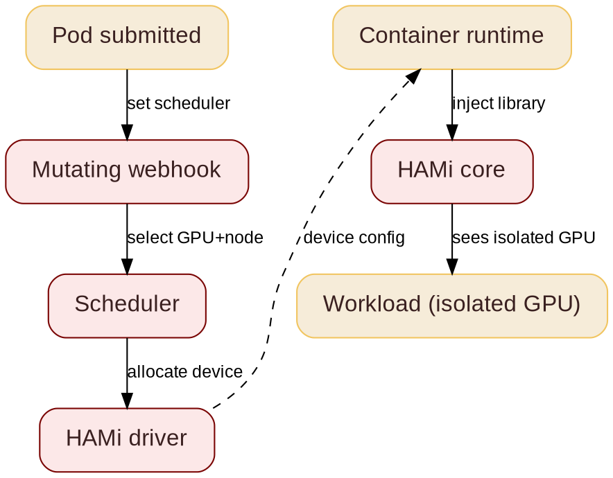

@variant dark
@kicker KubeCon + CloudNativeCon China 2026
# 用 HAMi 加速 Kubernetes 上的 AI

@subtitle 切分一块 GPU, 运行多个工作负载

@speaker name="Reza Jelveh" role="Dynamia AI 解决方案架构师, HAMi 开发者" github=github.com/fishman linkedin=linkedin.com/in/rezajelveh

---

# 第 1 部分: 问题

@subtitle GPU 很贵, 而 Kubernetes 并不擅长共享它们

---

@layout image-right

## 问题所在

@subtitle 默认是一任务一块 GPU

Kubernetes 以原子方式分配 GPU: 一块完整设备, 一个任务。

- 一个 1 GB 的任务堵住一块 80 GB 的设备
- 大多数 GPU 大部分时间闲置
- DRA (动态资源分配) 已稳定, 但仍在演进
- 还没有高级调度: 没有 binpack、没有 spread、没有拓扑


---

## 什么是 HAMi

@subtitle 之前: 一块 GPU, 一个任务

<!--
GPU 昂贵且常常闲置。HAMi 是面向 Kubernetes 的异构 GPU 共享框架。它把 GPU 切开并跨负载共享, 无需改写你的技术栈。
-->


---

## 什么是 HAMi
@transition none

@subtitle 之后: 一块 GPU, 多个任务


---

@layout compare

## GPU 的挑战

@subtitle 哪里会崩, HAMi 要解决什么

::: card {tag=compare}
### 现状问题

- GPU 稀缺, 且整卡分配
- 厂商锁定, 供给紧张
- 利用率卡在 10%
- 没有统一的观测能力
- 推理负载碎片化
:::

::: arrow

{icon:arrow-right cls=accent-primary size=48}
:::

::: card {tag=compare}
### 需求

- 硬件无关: 一个 API, 任意加速器
- 分数 GPU: 细粒度切片, 每块设备多个任务
- 高级调度: binpack、spread、拓扑感知
- 跨厂商统一观测
:::

<!--
异构 GPU 共享意味着你可以让 NVIDIA A100、H100、昇腾或其他设备跑在同一个集群里, 无需手工分区。HAMi 负责调度逻辑。真正的工作是内存隔离。
-->

::: notes{ tag="green" }
统一观测, GPU 利用率 50%, 运行的工作负载 10x, GPU 可用性 10x。AMD MI355X: 约 1/3 的价格达到 B200 80% 的性能。不是人人都需要 Vera Rubin。
:::


@layout compare


---

# 第 2 部分: 解决方案

@subtitle 无需改代码。无需内核模块。无厂商锁定。

---

## DRA 功能时间线

@subtitle KEP 及其开发状态: 今天不展开讲

<!--
备用幻灯片。展示全部 DRA KEP 及其开发状态。说明 DRA 演进很快 - 1.34 稳定。我们会跳过这一页, 留作答疑。
-->


---

@layout image-right

## DRA: ResourceSlice

@subtitle 每节点的设备清单

<!--
DRA 驱动跑在每个节点上, 发布可用设备。调度器读取 ResourceSlices 来找到能满足 claim 的节点。调度器就是这样知道哪些硬件空闲的。
-->


- **ResourceSlice:** 列出节点上所有可用设备及其属性
- DRA 驱动发布切片; 调度器读取它们把 claim 匹配到设备
- 通过 `nodeName` 绑定到节点, 支持拓扑与 NUMA 属性

---

@layout image-right

## DRA: ResourceClaim

@subtitle 请求硬件的标准化方式: 不只是 GPU。K8s 1.34 起稳定。

<!--
DeviceClass 按能力给设备分类。ResourceClaim 从该类别中请求特定硬件。ResourceClaimTemplate 自动为每个 Pod 创建 claim。合在一起, 它们取代了旧的设备插件模型。
-->


- **DeviceClass:** 把资源模型相同的设备分组。**ResourceClaim:** 工作负载通往硬件的门票。**ResourceClaimTemplate:** 可复用的蓝图, 自动为每个 Pod 建 claim。

---

## HAMi 核心能力

@subtitle HAMi 为 GPU 调度带来的六项能力

<!--
六项能力。与本次演讲最相关的: 硬隔离、高级调度、统一监控。异构管理才是差异化所在 - 不只是 NVIDIA。
-->

::: grid {cols=2}
::: card
### {icon:layers cls=accent-primary} 异构设备统一管理

在一套工作流里管理 GPU、NPU、MLU 及其他加速器。
:::
::: card
### {icon:shield-check cls=accent-primary} 硬隔离

按切片划分内存与算力, 运行期硬性隔离。
:::
::: card
### {icon:git-branch cls=accent-contrast} 高级调度

Binpack、spread 与拓扑感知的放置策略。
:::
::: card
### {icon:box cls=accent-primary} Kubernetes 原生

Kubernetes 原生 API, 支持 DRA 与 CDI。
:::
::: card
### {icon:gauge cls=accent-primary} 资源隔离与 QoS

内存与算力配额, 保证公平、稳定共享。
:::
::: card
### {icon:chart-bar cls=accent-contrast} 统一监控

跨厂商一致的指标与可见性。
:::
:::

---

@layout two-col

## GPU 共享

@subtitle 动态、细粒度的设备切分

<!--
跨厂商同一份 YAML。右侧是昇腾示例。显存是硬上限, 算力是尽力而为。这才是用户真正写的东西。
-->

- 支持 **NVIDIA、昇腾、寒武纪、海光、沐曦**
- **细粒度:** 最小 1MB 显存、1% 算力
- **对任务透明:** 无需改动任何代码
- 容器内**硬性资源隔离**
- 跨厂商统一 API: 同一份 YAML, 任何加速器

@col

```yaml
# 昇腾 910C: 8GB + 20% 算力
resources:
  limits:
    huawei.com/Ascend910C: "1"
    huawei.com/Ascend910C-core: "20"
    huawei.com/Ascend910C-memory: "8192"
```

```yaml
# NVIDIA: 任意 GPU 上 3GB
resources:
  limits:
    nvidia.com/gpu: 1
    nvidia.com/gpumem: 3000
```

---

@layout two-col

## HAMi 如何工作

@subtitle 从提交 Pod 到隔离 GPU

<!--
从提交 Pod 到隔离 GPU 共五个阶段。变更 webhook 路由 Pod, 调度器选择设备, HAMi 核心库在容器内执行隔离。
-->

- **变更 webhook:** 看到 GPU 请求, 把 Pod 路由到 HAMi 调度器
- **调度器:** 选择 GPU 与节点
- **HAMi 驱动:** 生成设备配置
- **容器运行时:** 读取配置, 注入 HAMi 核心库
- **HAMi 核心:** 在进程内执行隔离

@col



---

@layout two-col

## 魔法所在: CUDA 劫持

@subtitle 你的应用无需改动

<!--
HAMi 随附一个小库。容器运行时在你应用启动前加载它。它拦截 CUDA 调用并返回属于你的切片。无需改代码、无需内核模块、无需驱动改动。
-->

你的应用调用 CUDA。HAMi 用一块 GPU 切片应答。

- 在你的应用之前加载的小库 (`LD_PRELOAD`)
- 拦截 CUDA 调用, 应用代码零改动
- 无需内核模块、无需驱动改动
- 兼容任何框架: PyTorch、TensorFlow、vLLM

@col


---

## 为什么内存隔离很重要

@subtitle 一个失控的任务不能拖垮邻居

<!--
没有隔离, 一个工作负载就能抢走全部内存, 把同一 GPU 上的其他任务 OOM 杀掉。HAMi 在劫持 CUDA API 调用时执行内存隔离: 每个任务只看到自己那片。
-->

::: grid {cols=2}
::: card {tag=red}
### {icon:triangle-alert cls=accent-secondary} 没有 HAMi

任务之间没有边界共享一块 GPU。一个贪心的任务吃光所有内存, 杀掉邻居。多租户意味着有风险。
:::
::: card {tag=green}
### {icon:shield-check cls=accent-primary} 有了 HAMi

每个任务只看到自己的切片。内存是硬上限, 由被劫持的 CUDA 调用执行: 每次分配都会被对照你的切片检查。
:::
::: card {tag=yellow}
### {icon:refresh-cw cls=accent-contrast} 超卖

闲置内存可以换到主机内存, 于是能塞下更多模型。适合推理, 不适合活跃训练。
:::
::: card {tag=cyan}
### {icon:gauge cls=accent-contrast} 每任务限额

```yaml
resources:
  limits:
    nvidia.com/gpu: 1
    nvidia.com/gpumem: 3000
```
任意 GPU 上的 3 GB 切片。同一份 YAML 也适用于昇腾、寒武纪等。
:::
:::

---

## GPU 共享的几种方式

@subtitle MIG 对比 HAMi 对比 NVIDIA DRA

<!--
常见问题: 为什么不用 MIG? MIG 不是所有设备都支持, 而且需要手工模板。NVIDIA DRA 支持 MIG、MPS 与 VFIO, 但没有高级调度。HAMi 加入符号劫持实现亚 MIG 级切分, 并提供多厂商支持。
-->

| 能力 | MIG | HAMi | NVIDIA DRA |
|------------|:---:|:---:|:---:|
| 亚 MIG 级切分 | {icon:x cls=accent-secondary} | {icon:check cls=accent-primary} | {icon:x cls=accent-secondary} |
| 动态重分 | {icon:x cls=accent-secondary} | {icon:check cls=accent-primary} | {icon:check cls=accent-primary} |
| 多厂商 | {icon:x cls=accent-secondary} | {icon:check cls=accent-primary} | {icon:x cls=accent-secondary} |
| 高级调度 | {icon:x cls=accent-secondary} | {icon:check cls=accent-primary} | {icon:x cls=accent-secondary} |
| 无需改代码 | {icon:x cls=accent-secondary} | {icon:check cls=accent-primary} | {icon:x cls=accent-secondary} |

HAMi 的差异化来自符号劫持 (NVIDIA 上 1 MiB 粒度)、可消耗的容量让请求更灵活, 以及多厂商支持。HAMi-DRA 构建在 NVIDIA 上游 DRA 驱动之上, 并支持多个 DRA 驱动。

---

## 可消耗的容量

@subtitle GPU 资源是一个你按需取用的资源池

<!--
GPU 资源是可消耗的: 内存按 MiB, 算力按 GPU SM 的百分比。调度器跟踪每台设备的剩余容量并按它装箱。HAMi 核心在被劫持的 CUDA 调用上执行上限; Pod 里的 nvidia-smi 显示的是你的切片, 不是整卡。自 v2.8 起, DRA 路径上也有同样的语义 (ResourceSlice 类型化容量, ResourceClaims)。
-->

::: grid {cols=2}
::: card {tag=cyan}
### {icon:gauge cls=accent-primary} 内存与算力是两条独立轴

请求显存的 MiB 与 GPU SM 的百分比。用多少给多少, 没有固定档位。
:::
::: card {tag=green}
### {icon:layers cls=accent-primary} 调度器按剩余容量装箱

每块 GPU 都上报剩下的内存与算力。Binpack 与 spread 策略把请求填进缝隙。
:::
::: card {tag=yellow}
### {icon:shield-check cls=accent-contrast} 在被劫持的调用上执行

HAMi 核心把每次分配封顶在你的切片。Pod 内 nvidia-smi 显示 0 MiB / 4000 MiB。
:::
::: card {tag=red}
### {icon:git-branch cls=accent-contrast} DRA 上语义相同 (v2.8+)

类型化 ResourceSlice 容量 (内存步进 1 MiB, 算力 0-100)。请求变成 ResourceClaims。
:::
:::

@row

```yaml
resources:
  limits:
    nvidia.com/gpu: 1          # 一个 vGPU 切片
    nvidia.com/gpumem: 4000    # 4000 MiB 显存
    nvidia.com/gpucores: 30    # 占 GPU SM 的 30%
```

---

@layout image-right

## 调度策略

@subtitle Binpack 与 Spread

<!--
两条轴, 四种组合。节点 binpack 省钱, 节点 spread 保可用性。GPU binpack 为训练省下整卡, GPU spread 保尾延迟。按负载取舍: 训练想要 binpack, 带 SLO 的推理想要 spread。
-->


- **节点 binpack** 释放整台机器: 降低成本, 帮助集群自动扩缩容
- **节点 spread** 隔离故障: 跨可用区高可用, 控制爆炸半径
- **GPU binpack** 防止碎片化: 为训练腾出整块 GPU
- **GPU spread** 保护尾延迟: 降低 HBM 与 NVLink 争用
- 高级调度可与独立 HAMi 一起用; DRA 模式可以用 Yunikorn

---

@layout two-col

## 节点 Binpack

@subtitle 集中任务, 释放整台机器

<!--
节点 binpack 优先填满使用率最高的节点。任务落到仍有容量但最满的节点上, 于是空节点保持闲置, 可以缩容到零。成本逻辑: 活跃节点更少、功耗更低、占用更小。
-->

- 优先填最满的节点, 最空的最后填
- 释放整台机器: 未用的节点保持闲置, 随时可断电
- 降低成本: 活跃节点更少、功耗更低、占用更小
- 配合集群自动扩缩容: 空节点被自动移除
- 最适合: 成本敏感的集群、批处理与离线任务、开发与测试集群

@col


---

@layout two-col

## 节点 Spread

@subtitle 一节点一任务, 故障只留在本地

<!--
节点 spread 把每个任务放到不同节点上。一次节点宕机、重启或排空只影响一个任务, 而不是整个集群。高可用打法: 用于生产在线服务与多租户集群。它比 binpack 多消耗节点。
-->

- 一节点一任务: 负载在集群间均衡
- 故障隔离: 一次节点宕机或重启只干掉一个任务, 不是全部
- 扛得住维护: 节点排空一次只影响一个副本
- 用于: 带 SLA 的生产推理。丢一个节点只丢一个副本, 不是整个模型

@col


---

@layout two-col

## GPU Binpack

@subtitle 填满一块 GPU, 腾出其余的

<!--
GPU binpack 把几个任务放到同一块 GPU 上。每个都有自己的一片内存与算力。当 GPU 稀缺时这最重要: 训练需要整卡, 所以别让小任务把整卡切碎。
-->

- 多个任务共享一块 GPU, 各有自己的一片内存与 SM
- 防止碎片化: 零散的小任务不再堵死整块 GPU
- 为不能共享的训练任务腾出整块 GPU
- 最适合: 成批的小负载 - 推理端点、批处理任务、开发与测试

@col


---

@layout two-col

## GPU Spread

@subtitle 一 GPU 一任务, 没有共享瓶颈

<!--
GPU spread 把每个任务放到同一节点上各自独立的 GPU。没有租户与别的租户共享算力、HBM 带宽或 NVLink。如果一个任务把自己那块 GPU 拖垮, 邻居不受影响。用于对延迟敏感的在线服务。
-->

- 一 GPU 一任务: 算力与 HBM 带宽永不共享
- 隔离吵闹的邻居: 一块 GPU 上的失控者不会拖慢其他 GPU
- 保护尾延迟: 没有跨租户的 NVLink 或 HBM 争用
- 最适合: 有严格 SLO 的对延迟敏感的在线服务

@col


---

@layout image-right

## 调度策略

@subtitle 拓扑感知

<!--
NVLink 与 PCIe 之间有 7-14 倍的带宽差。HAMi 把多 GPU 工作负载调度到 NVLink 相连的配对, 避开 PCIe 桥接配对。昇腾用 HCCS, 其他厂商有自己的高速互联: 同样的拓扑逻辑适用。这对张量并行与大模型训练很关键。
-->


- **NVLink 3 (A100):** 600 GB/s, 12 条链路
- **NVLink 4 (H100/H200):** 18 条链路上 900 GB/s 双向
- **NVLink 5 (B200/B300):** 1.8 TB/s, 是 PCIe 5.0 的 14 倍
- **NVLink 6 (Rubin):** 目标约 3.6 TB/s
- **PCIe 5.0 x16:** 128 GB/s。**PCIe 6.0:** 242 GB/s
- **HAMi 拓扑策略:** 优先 NVLink (NVIDIA)、HCCS (昇腾) 及其他高速互联, 避开 PCIe 桥接配对

---

## 负载感知调度

@subtitle 上游 Kubernetes 正在追赶

<!--
WAS 是 WG Batch 与 SIG Scheduling 的上游工作: 一个 Workload API, 让调度器把一组 Pod 当做一个单元。Gang 调度在 v1.35 以 alpha 落地, 基于 DRA 的 GPU 调度在 v1.36。高级策略仍是插件的领地。
-->

- **它是什么:** 一个 Workload API, 让调度器把一组 Pod 当做一个单元
- **Gang 调度 (v1.35, alpha):** 全有或全无的放置, 不会出现只开一半的训练任务
- **GPU 调度 (v1.36):** 基于 DRA 的负载感知放置
- **现状:** 高级策略 (binpack、spread、拓扑) 仍然活在插件和 HAMi 这类工具里

---

## 常见坑

@subtitle 硬件限制与 Kubernetes 的缺口

<!--
共享 GPU 时有两个坑。MIG 并非每台设备都可用, DRA 已稳定但平台上仍缺高级调度。
-->

::: grid {cols=2}
::: card {tag=cyan}
### {icon:layers cls=accent-primary} MIG 不是处处可用

MIG 需要较新的数据中心 GPU 与固定档位。软件切分跑在任意设备上。
:::
::: card {tag=green}
### {icon:git-branch cls=accent-primary} K8s GPU API 还很年轻

DRA 已稳定, 但高级调度 (binpack、spread、拓扑) 仍不在平台里。
:::
:::

---

# 第 3 部分: 生产实践

@subtitle 真实团队怎么用 HAMi

---

@layout metrics
## HAMi 今天走到哪了

@subtitle 来自 CNCF 案例的生产指标

::: grid {cols=4}
::: card {metric}
0
驱动、内核、代码改动
SF Technology
:::
::: card {metric}
1-2 GB
每个小模型推理服务的内存
KE Holdings
:::
::: card {metric}
4x
GPU 利用率: 5-10% 提升到 30-50%
NIO
:::
::: card {metric}
90%
HAMi 管理的 GPU 基础设施 (RTX 4070/4090)
Prep Edu
:::
:::

@row

::: notes{ tag="green" }
China Merchants Bank - SNOW Corp. - NIO - KE Holdings - DaoCloud - SF Technology - Prep Education - [cncf.io/case-studies](https://www.cncf.io/case-studies/)
:::

---

@layout ecosystem
## 社区与采纳者

@subtitle 设备、集成, 以及谁在用 HAMi

<!--
5.2k star, 325k 拉取, 500+ 贡献者, 27 个国家。11 种设备, 20+ 采纳者。这是生态全景页: 展示广度。二维码链接到 github.com/Project-HAMi/HAMi。
-->

#### 开源, CNCF 背书, 生产就绪
::: grid {cols=5}
::: card {metric}
5.2k
Github Star
:::
::: card {metric}
325k
Docker 拉取
:::
::: card {metric}
500+
贡献者
:::
::: card {metric}
27
贡献者所在国家
:::
::: card

     
:::
:::

#### 生态与设备支持
::: grid {cols=2}
::: card
    
   
 
:::
:::

#### 采纳者
::: grid {cols=2}
::: card
    
    
    
    
:::
:::

---

@kicker 谢谢
# 有问题? 试试 HAMi

@subtitle github.com/Project-HAMi/HAMi

**有我们还没支持的设备? 我们很乐意上手玩玩。**

@speaker name="Reza Jelveh" role="Dynamia AI 解决方案架构师, HAMi 开发者" github=github.com/fishman linkedin=linkedin.com/in/rezajelveh
